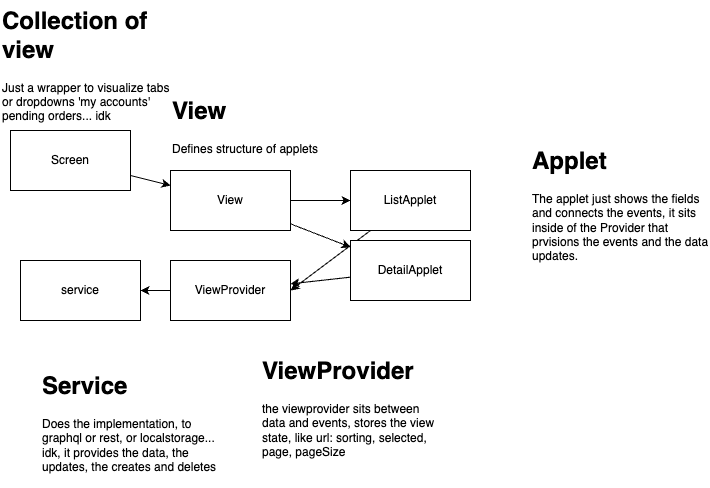

# Architecture

## Core Components

### Applet

An applet is a collection of fields and buttons that trigger events. It represents the smallest unit of UI functionality in the system.
Applets are responsible for:

- Displaying data fields
- Handling user interactions
- Triggering events
- Managing local state for its specific functionality

### View

A view is a collection of applets that work together to provide a complete user interface for a specific feature or functionality. Views:

- Organize applets in a logical layout
- Coordinate interactions between applets
- Provide a cohesive user experience for a specific feature

### Screen

A screen is a collection of views that make up a complete application page. Screens:

- Define the overall layout of the application
- Manage navigation between views
- Handle application-level state and routing

### ViewProvider

The ViewProvider acts as a bridge between applets and services. It:

- Manages the state shared between applets
- Coordinates data flow between applets and services
- Handles URL-based state persistence
- Manages sorting, filtering, and pagination state

### Service

Services are responsible for data operations and external communication. They:

- Handle data fetching from various sources (REST, GraphQL, etc.)
- Manage data transformations
- Handle caching and state management
- Provide a consistent interface for data operations

## Architecture Review

This architecture follows several important design principles:

### Single Responsibility Principle

- Each component has a clear, focused responsibility
- Applets handle UI and user interactions
- Views manage feature-level organization
- Screens handle application-level concerns
- ViewProvider manages state and data flow
- Services handle data operations

### Separation of Concerns

- Clear separation between UI components and data operations
- Decoupled components that can be developed and tested independently
- Clear boundaries between different layers of the application

### Maintainability

- Modular design makes it easy to modify or replace components
- Clear component hierarchy makes the codebase easier to understand
- Consistent patterns across the application

### Scalability

- Components can be reused across different parts of the application
- New features can be added by creating new applets and views
- Services can be extended to support new data sources

### Best Practices

- URL-based state persistence for better user experience
- Consistent patterns for data flow and state management
- Clear separation between UI and business logic
- TypeScript support for better type safety and developer experience

This architecture provides a solid foundation for building scalable and maintainable applications while following modern React best
practices.
