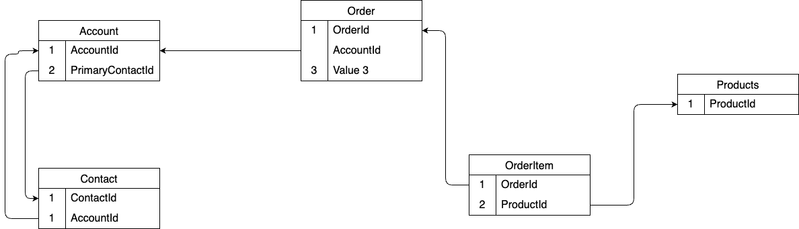

# Data Management

This application implements a simple but effective data management layer using:

- JSON Server as the backend database
- GraphQL wrapper for flexible data querying
- Nodemon for development hot-reloading

## Data Model

## Core Entities

### Account

- Primary entity for business accounts
- Contains basic company information
- Links to contacts through primaryContactId
- Includes address information

### Contact

- Represents individuals associated with accounts
- Contains personal and professional information
- Links to account through accountId
- Includes optional fields like title and phone

### Order

- Represents business transactions
- Contains order details and status
- Links to products through order items
- Tracks total amount and dates

### Product

- Represents items that can be ordered
- Contains product details and pricing
- Tracks inventory through stock field
- Includes SKU for product identification

## Data Flow

1. **Client Layer**

   - React components make GraphQL queries/mutations
   - Uses Apollo Client for state management
   - Implements optimistic updates for better UX

2. **API Layer**

   - GraphQL resolvers handle data operations
   - Implements sorting, filtering, and pagination
   - Provides type-safe data access

3. **Storage Layer**
   - JSON Server provides REST endpoints
   - Persists data in a JSON file
   - Supports basic CRUD operations

## API Patterns

### REST Endpoints

All entities support standard CRUD operations:

- GET /{entity} - List all
- GET /{entity}/{id} - Get one
- POST /{entity} - Create
- PATCH /{entity}/{id} - Update
- DELETE /{entity}/{id} - Delete

### GraphQL Operations

Supported operations include:

- Queries with filtering and sorting
- Mutations for data modifications
- Nested resolvers for related data
- Pagination support

## State Management

1. **Server State**

   - Handled by Apollo Client
   - Implements caching
   - Manages data invalidation

2. **View State**

   - Managed by ViewProvider
   - Persists in URL parameters
   - Handles sorting/filtering state

3. **Local State**
   - React component state
   - Context for shared state
   - Local storage for persistence

## Data Validation

1. **Client-side**

   - TypeScript interfaces
   - Form validation
   - Business logic checks

2. **Server-side**
   - GraphQL schema validation
   - Business rule enforcement
   - Data integrity checks

## Error Handling

1. **Client Errors**

   - Network error handling
   - Validation error display
   - Optimistic update rollback

2. **Server Errors**
   - GraphQL error responses
   - HTTP status codes
   - Error logging

## Development Tools

1. **API Testing**

   - HTTP request files for REST testing
   - GraphQL Playground
   - Postman collections

2. **Data Monitoring**
   - Apollo Client DevTools
   - React DevTools
   - Network monitoring

## Best Practices

1. **Performance**

   - Implement proper caching
   - Use pagination for large datasets
   - Optimize query responses

2. **Security**

   - Validate all inputs
   - Sanitize data
   - Implement proper error handling

3. **Maintainability**
   - Follow consistent naming conventions
   - Document API changes
   - Maintain type safety
